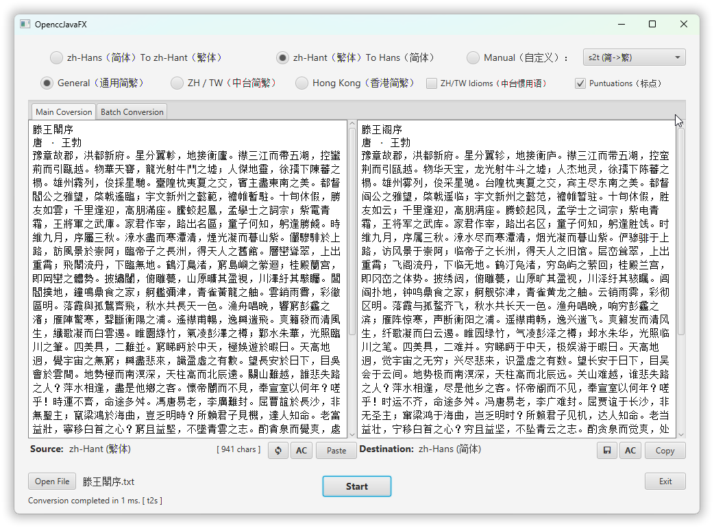
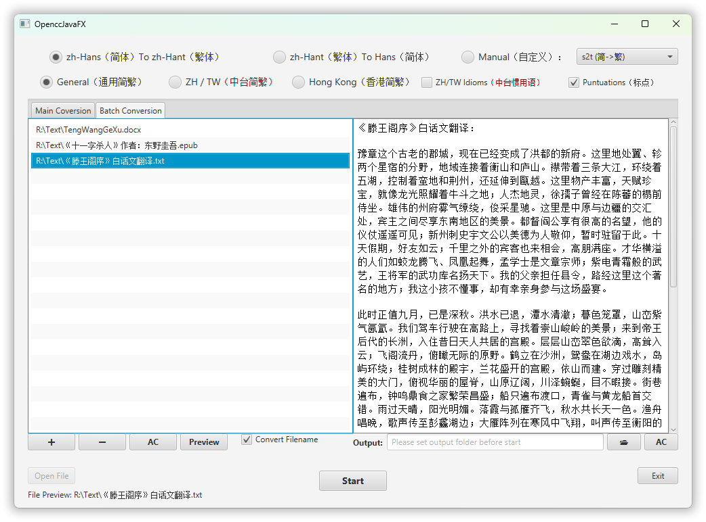

# OpenccJavaFX

[](https://github.com/laisuk/OpenccJavaFX/releases/latest)
[](LICENSE)
[](https://github.com/laisuk/openccjavafx/releases)
[](https://github.com/laisuk/openccjavafx/releases/latest)

**OpenccJavaFX** is a Chinese text conversion application built with JavaFX and the FXML design pattern. It leverages
the [OpenccJava](https://github.com/laisuk/OpenccJava) library to provide simplified and traditional Chinese conversion.

---

## 🚀 Download

Download the latest version of **OpenccJavaFX** for your platform
at [Release](https://github.com/laisuk/OpenccJavaFX/releases) section.

> 📦 These are **Java builds**, targeting `Java 17+`.  
> You must have [Java Runtime 17+](https://www.azul.com/downloads/?package=jdk) installed to run them.

---

## Features

- **Chinese Conversion**: Convert between simplified and traditional Chinese text.
- **Single/Batch Conversion**: Perform Chinese text conversion in single or batch mode.
- Designed to convert most **text based file types** and **Office documents** (`.docx`, `.xlsx`, `.pptx`, `.odt`)

---

## Dependencies

- [JavaFX](https://openjfx.io/): Cross-platform Java UI framework.
- [RichTextFX](https://github.com/FXMisc/RichTextFX): Text editor for JavaFX with virtualization support.
- [OpenccJava](https://github.com/laisuk/OpenccJava): Pure Java library for conversions between Traditional and
  Simplified Chinese.
- [picocli](https://github.com/remkop/picocli): A modern framework for building powerful, user-friendly command line
  apps with ease.

---

## Getting Started

**Clone the repository**:

```bash
git clone https://github.com/laisuk/OpenccJavaFX.git
```

**Navigate to the project directory**:

```bash
cd OpenccJavaFX
```

**Build the project**:

```bash
./gradlew build
```

**Run the application**:

```bash
./gradlew run
```

---

## Usage

### Single Mode



Support most **text base** file types.

1. Paste the text or open a file you wish to convert (file/text drag and drop are supported).
2. Select the desired conversion configuration (e.g., Simplified to Traditional).
3. Click the **Start** button to see the results.

---

### Batch Mode




Support most **text base** file types, **Office documents** (`.docx`, `.xlsx`, `.pptx`, `.odt`, `.ods`, `.odp`) and
EPUB (`.epub`).

1. Select or drag file(s) into the source list box.
2. Select the desired conversion configuration.
3. Set the output folder.
4. Click the **Start** button to begin batch conversion.

---

## Contributing

Contributions are welcome! Please fork the repository and submit a pull request for any enhancements or bug fixes.

---

## License

This project is licensed under the MIT License. See the [LICENSE](./LICENSE) file for details.

---

## Acknowledgements

- [OpenCC](https://github.com/BYVoid/OpenCC) for the Chinese text conversion lexicon.
- [OpenccJava](https://github.com/laisuk/OpenccJava) for the Java Chinese conversion library.
- [JavaFX](https://openjfx.io/) for the cross-platform UI framework.
- [RichTextFX](https://github.com/FXMisc/RichTextFX) for the text editor with virtualization.
